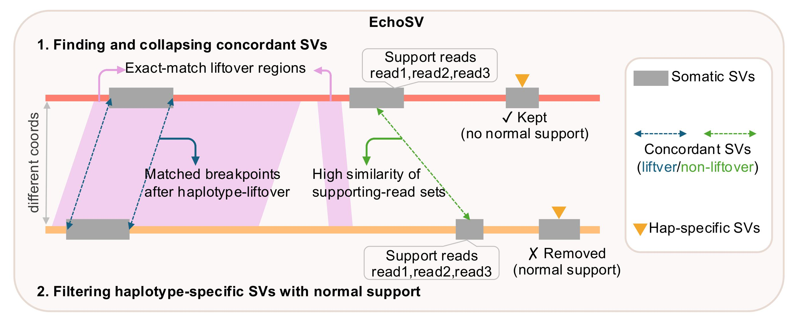

# EchoSV

EchoSV is a versatile tool for comparing and merging structural variant (SV) call sets generated using different reference genomes. It studies how SVs "echo" across these references through a hybrid workflow that combines liftover and graph-based matching.



Given two or more SV call sets from the same sample—each aligned to a different reference—EchoSV can perform two primary operations:
- **Compare**: Generates a detailed comparison identifying overlapping variants and those exclusive to a specific reference, e.g., calls across GRCh38, CHM13, and a donor-specific assembly (DSA).
- **Merge**: Consolidates multiple SV call sets into a single, unified output, e.g., merging two DSA haplotype-based call sets into one consolidated file.

## Table of Contents

- [Requirements](#requirements)
- [Installation](#installation)
- [Usage](#usage)
- [License](#license)
- [Contact](#contact)

## Requirements

EchoSV depends on the following Python packages:
- [**pysam**](https://github.com/pysam-developers/pysam): Read and write BAM/CRAM files and VCF records for variant processing.
- [**intervaltree**](https://github.com/chaimleib/intervaltree): Efficiently store and query genomic intervals to detect overlapping SVs.
- [**Biopython (Bio)**](https://github.com/biopython/biopython): Parse and manipulate sequence data during liftover steps.
- [**scipy**](https://github.com/scipy/scipy): Perform statistical analysis and numerical computations on variant metrics.
- [**networkx**](https://github.com/networkx/networkx): Construct and traverse graphs that model structural variant matches.
- [**pandas**](https://github.com/pandas-dev/pandas): Tabular data manipulation for comparison outputs.
- [**numpy**](https://github.com/numpy/numpy): Numerical computations on variant metrics.
- [**rich**](https://github.com/Textualize/rich): Formatted terminal output and progress display.

## Installation

**Option 1: From GitHub (recommended)**

```bash
git clone git@github.com:parklab/EchoSV.git
cd EchoSV
pip install -r requirements.txt
pip install .
```

**Option 2: Via PyPI**

```bash
pip install echosv
```

## Usage

The EchoSV workflow consists of four main steps: **chain**, **merge** (optional), **genotype**, and **match**. Below are detailed instructions and examples using the test data (can be downloaded from [Zenodo](https://doi.org/10.5281/zenodo.20086366)).

### Step 0: Download and uncompress test data

Download the EchoSV test data `echosv_test_data.tar.gz` from [Zenodo](https://doi.org/10.5281/zenodo.20086366) and decompress it:

```bash
tar -xzvf echosv_test_data.tar.gz
```

### Step 1: Generate chains

The `chain` command generates a liftover chain file that maps coordinates from **ref2** (the source assembly) to **ref1** (the target reference). Before running `chain`, align ref2 against ref1 using [minimap2](https://github.com/lh3/minimap2)'s asm-to-asm mode and index the output:

```bash
minimap2 -a -x asm5 --cs ref1.fa ref2.fa \
    | samtools view -hSb - \
    | samtools sort -O BAM -o ref2_to_ref1.bam
samtools index ref2_to_ref1.bam
```

Then generate the chain file. EchoSV looks for a pre-built index automatically to parse the contig lengths; if none exist, the FASTA is parsed directly (slower for large assemblies). You can generate an index with `samtools faidx ref2.fa` or `samtools dict ref2.fa > ref2.fa.dict`.

```bash
echosv chain \
    -b test_data/input_data/chm13_to_grch38.bam \
    -f test_data/input_data/chm13.fa \
    -o test_data/chm13_to_grch38.chain.gz
```

<details>
<summary><strong>Parameters</strong></summary>

-  `-b`: Path to the ref2-to-ref1 alignment (BAM format, must be indexed)
-  `-f`: Path to the ref2 reference FASTA
-  `-o`: Output chain file for coordinate mapping (a coverage BED file is also written alongside)

</details>

### Step 2: Merge SV call sets from the same reference (optional)

<details>
<summary>Merge multi-caller VCFs from the same reference into one call set before genotyping.</summary>

The `merge` command merges multiple SV call sets that were called against the **same** reference genome (e.g., outputs from multiple callers). This step is typically run before `genotype` and `match` so that each reference has a single unified call set for cross-reference comparison. Scripts to reproduce the analysis from our [paper](https://www.biorxiv.org/content/10.1101/2025.10.28.685155v1.abstract) are available in `scripts/`.

```bash
# Merge multiple VCFs from the same reference into a single call set
echosv merge \
    -i grch38_colo829_caller1.vcf.gz grch38_colo829_caller2.vcf.gz [...] \
    -o grch38_colo829_svs.vcf.gz \
    --merge --new

# Extract high-confidence SVs (≥4 supporting callers, ≥2 platforms)
echosv merge \
    -i grch38_colo829_svs.vcf.gz \
    -o grch38_colo829_svs_highconf.vcf.gz \
    --extract 
```

Pre-built gap BED files for the references used in this study are provided in the `src/echosv/beds/` directory; a new gap BED can be passed by using `--gapbed`.

**Parameters:**
-  `-i`: Input VCF file(s) — space-separated list for `--merge`, single file for `--extract`
-  `-o`: Output file path
-  `-a / --atol`: Positional tolerance in bp for matching breakpoints (default: 500)
-  `-s / --sizetol`: Minimum size-similarity ratio for matching SVs (default: 0.5)
-  `-c / --checksvtype`: Require matching SV types when merging
-  `--merge`: Write a merged VCF from the comparison result
-  `--new`: Build merged VCF records from scratch (use with `--merge`)
-  `--extract`: Extract high-confidence SVs (≥4 supporting callers and ≥2 platforms)
-  `--gaps-bed`: BED file of reference gap / N regions; SVs near gaps are excluded when using `--extract`
</details>

### Step 3: Collect supporting reads

The `genotype` command collects supporting reads for each SV from BAM files and annotates the VCF with allele-frequency and read-name fields used by the graph-based matching in Step 4.

```bash
echosv genotype --longread \
    -i test_data/input_data/grch38_colo829_somatic_svs.vcf.gz \
    -b test_data/input_data/chm13_to_grch38.bam \
    -o test_data/grch38_colo829_genotyped.vcf.gz
```

<details>
<summary><strong>Parameters</strong></summary>

-  `--longread`: Collect supporting reads from long-read alignments
-  `--shortread`: Collect supporting reads from short-read alignments
-  `-i`: Input SV VCF file
-  `-b`: BAM file(s) — multiple BAMs can be provided space-separated
-  `-o`: Output VCF with annotated supporting-read information

</details>

### Step 4: Match SVs across references

The `match` command compares SV call sets across different reference genomes using a two-step hybrid approach: liftover-based coordinate matching followed by graph-based matching on shared supporting reads (echo score).

```bash
# Compare SV call sets and report concordant / reference-exclusive variants
echosv match -i test_data/test_colo829_config.json

# Compare SV call sets between DSA haplotypes and also produce a merged DSA-based VCF
echosv match -i dsa_merge_colo829_config.json --merge 
```

The input is a JSON config file specifying reference labels, genotyped VCFs, chain files, and the output path. See `test_data/test_colo829_config.json` below for a working example.

<details>
<summary><strong>Example JSON</strong></summary>

```json
{
    "refs":   { "1": "grch38", "2": "chm13", "3": "dsa" },
    "vcfs":   { "1": "./test_data/grch38_colo829_genotyped.vcf.gz",
                "2": "./test_data/chm13_colo829_genotyped.vcf.gz",
                "3": "./test_data/dsa_colo829_genotyped.vcf.gz" },
    "chains": { "2_to_1": "./test_data/chm13_to_grch38.chain.gz",
                "3_to_1": "./test_data/colo829bl_hap*_grch38.chain.gz" },
    "output": "./test_data/colo829_svs_comparison.txt"
}
```

</details>

<details>
<summary><strong>Parameters</strong></summary>

-  `-i`: Input config JSON file
-  `--merge`: Merge concordant SVs across references and write a unified VCF
-  `--multiplat`: Use multi-platform genotyping information during matching
-  `-m / --min_echo_score`: Minimum echo score to consider two SVs a match (default: 0.5)

</details>

## License

This project is licensed under the MIT License — see the [LICENSE](LICENSE) file for details.

## Contact

Feel free to open an issue on GitHub or contact Yuwei Zhang ([yuwei_zhang@hms.harvard.edu](mailto:yuwei_zhang@hms.harvard.edu)) if you have any questions about EchoSV.
